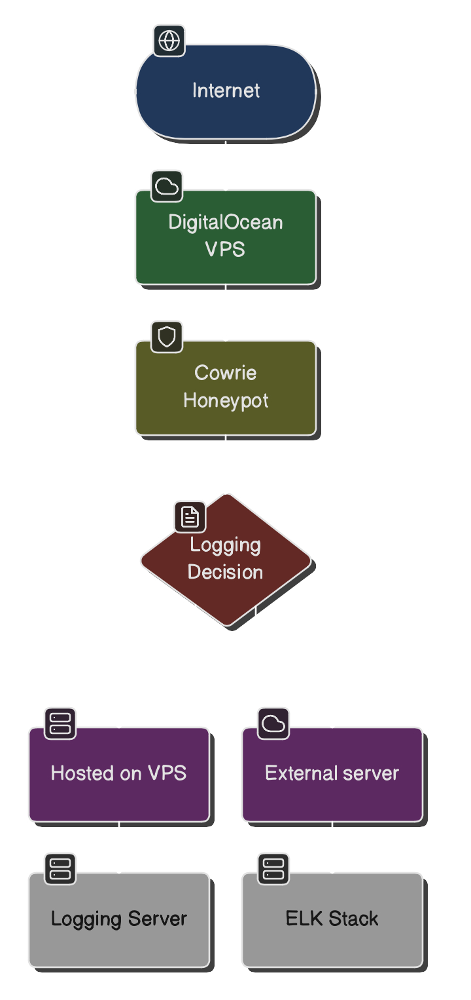

# Honeypot Project

This repository contains the setup and configuration files for deploying a Cowrie honeypot on an Ubuntu 22.04.1 LTS virtual machine. The honeypot is isolated within a DMZ network to ensure a secure and robust deployment.

## Project Overview
The goal of this project is to simulate vulnerable services using Cowrie to collect and analyze malicious traffic. Logs from the honeypot are forwarded to a remote logging server for detailed monitoring and forensic analysis.

### Key Features
- **Honeypot Framework:** Cowrie
- **Platform:** Ubuntu 22.04.1 LTS (hosted on a VM)
- **Network Isolation:** DMZ configuration
- **Log Management:** Remote logging server integration

## Setup Instructions

### Prerequisites
1. A laptop with a hypervisor installed (e.g., VirtualBox, VMware, or Parallels).
2. Ubuntu 22.04.1 LTS ISO for creating the virtual machine.
3. A router/firewall capable of setting up a DMZ.
4. Basic knowledge of Linux, networking, and firewall configuration.

### Installation Steps
1. **Create the VM**
   - Install and configure a hypervisor on your laptop.
   - Create a new VM and install Ubuntu 22.04.1 LTS.

2. **Set Up Cowrie**
   - Clone the Cowrie repository and follow the installation guide:
     ```bash
     git clone https://github.com/cowrie/cowrie.git
     cd cowrie
     sudo ./install.sh
     ```
   - Configure Cowrie to emulate desired services (e.g., SSH, Telnet).

3. **Network Configuration**
   - Assign the VM to the DMZ network (e.g., using VLANs or NAT with firewall rules).
   - Configure the firewall to allow inbound traffic to Cowrie and restrict outbound traffic.

4. **Log Forwarding**
   - Set up remote logging using tools like syslog or ELK stack (Elasticsearch, Logstash, Kibana).

## Logical Diagram
Below is a link to the logical diagram of the project. The diagram illustrates the network topology, including the Cowrie honeypot within the DMZ.



## Usage
- Monitor incoming traffic to the honeypot.
- Analyze captured logs for malicious activity.
- Use findings to improve network defense strategies.
