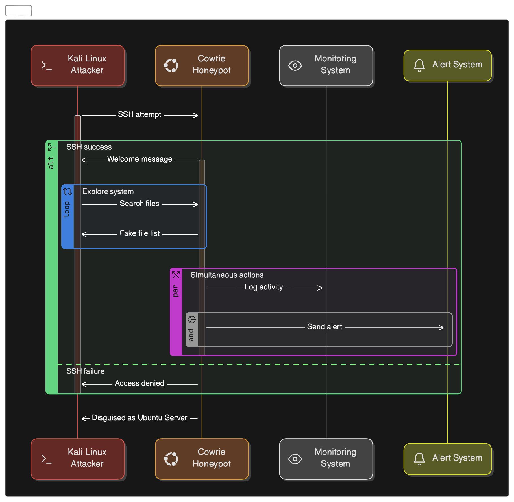

# Honeypot Project

This repository contains the setup and configuration files for deploying a Cowrie honeypot on an Ubuntu 22.04.1 LTS virtual machine. The honeypot is deployed on a Digital Ocean VPS to ensure a secure and robust setup.

## Project Overview
The goal of this project is to simulate vulnerable services using Cowrie to collect and analyze malicious traffic. Logs from the honeypot are forwarded to a remote logging server for detailed monitoring and forensic analysis.

### Key Features
- **Honeypot Framework:** Cowrie
- **Platform:** Ubuntu 22.04.1 LTS (hosted on a VPS)
- **Network Deployment:** Digital Ocean VPS
- **Log Management:** Remote logging server integration

## Setup Instructions

### Prerequisites
1. A Digital Ocean account for provisioning the VPS.
2. Basic knowledge of Linux, networking, and firewall configuration.
3. SSH client installed on your local machine for accessing the VPS.

### Installation Steps
1. **Provision the VPS**
   - Log in to your Digital Ocean account.
   - Create a new droplet using the Ubuntu 22.04.1 LTS image.
   - Configure the droplet’s size and region based on your requirements.

2. **Set Up Cowrie**
   - SSH into the VPS and clone the Cowrie repository:
     ```bash
     ssh root@<your-vps-ip>
     git clone https://github.com/cowrie/cowrie.git
     cd cowrie
     sudo ./install.sh
     ```
   - Configure Cowrie to emulate desired services (e.g., SSH, Telnet).

3. **Network Configuration**
   - Configure the VPS firewall using tools like `ufw` or Digital Ocean’s firewall settings.
   - Allow inbound traffic to Cowrie-specific ports (e.g., SSH, Telnet) and block unnecessary outbound traffic.

4. **Log Forwarding**
   - Set up remote logging using tools like syslog or ELK stack (Elasticsearch, Logstash, Kibana).

## Logical Diagram
Below is a link to the logical diagram of the project. The diagram illustrates the network topology, including the Cowrie honeypot on the Digital Ocean VPS.


## Sequence Diagram
Below is a link to a sequence diagram of the project. The diagram illustrates the flow of how Cowrie will analyze attackers actions to determine the goals of the attacker.



## Usage
- Monitor incoming traffic to the honeypot.
- Analyze captured logs for malicious activity.
- Use findings to improve network defense strategies.
